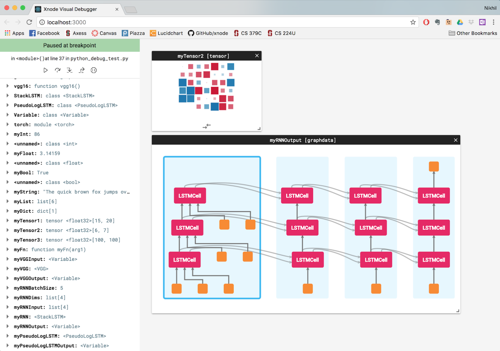

# Xnode DB
**Version:** 0.1a

Xnode facilitates quick and painless prototyping, experimenting, and sharing of neural network research through a
platform built by researchers, for researchers.

Xnode DB is the first iteration of Xnode — it is aimed specifically at the debugging experience. This is a minimum 
viable product that nevertheless extends the opportunity to test:

- visualization principles, UI, and graph layout algorithms for data structures and computation graphs
- executing code in a controlled Python shell
- integrating PyTorch APIs with visualizations

`pip install -r requirements.txt`

# Usage
1. Clone the repo and install all dependencies.
    - Ensure Python 3.6 and PyTorch are installed.
    - Run `pip install -r requirements.txt`.
    - Navigate to `xnode-db/server` and run `npm install`.
    - Navigate to `xnode-db/server/client` and run `npm install`.
2. In the `xnode-db` directory, start the example program with `python3 python_debug_test.py`. This program makes calls to the Xnode `viz` API, which sets up a debugging server and allows control of program execution from the debugging client.
3. To open a debugging client, navigate to `xnode-db/server/client` and run `npm start`. A browser window should open for `localhost:<port>`.